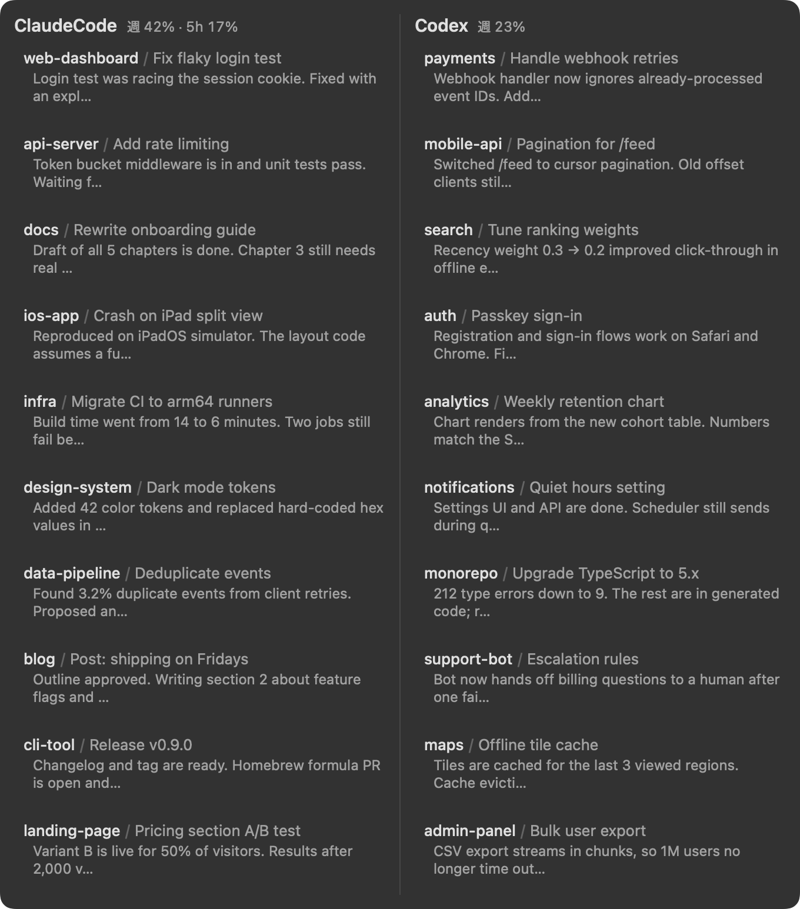

# agent-sessions-menubar

A tiny macOS menu bar app that shows where each of your recent **Claude Code** and **Codex** sessions left off, and copies the command to resume one with a single click.

<p align="center"></p>

<p align="center"><sub>Sample data. Click a row to copy <code>cd &lt;project&gt; &amp;&amp; &lt;resume command&gt;</code>.</sub></p>

When you run many agent sessions in parallel, it is easy to lose track of which one was doing what. This app lists the 10 most recent sessions of each tool, side by side, with a one-glance summary of their current state.

## Features

- **Two columns**: Claude Code on the left, Codex on the right, 10 sessions each.
- **Usage limits** next to each column title: weekly and 5-hour usage, for example `週 18% · 5h 4%` (週 = weekly). A window that the plan does not have is left out, and `—` means the numbers could not be fetched.
- **Header**: `<project directory> / <session title>`.
- **Summary line** (first 60 characters):
  - Claude Code: the session's **recap** (the "while you were away" summary) if it is newer than the last message, otherwise the last user/assistant message.
  - Codex: the last user/assistant message.
- **Ordered by the last message**, not by file modification time. Session files are rewritten even when nothing new was said, so mtime alone gives a misleading order.
- **Click to copy a resume command**, for example:
  - `cd /path/to/project && claude --dangerously-skip-permissions -r <session-id>`
  - `cd /path/to/project && codex resume <session-id>`
- Refreshes the lists when the popup opens and every 30 seconds. Reading is fast (well under a second) because files are scanned from the end. Usage limits are refreshed at most every 5 minutes.
- It never writes to `~/.claude` or `~/.codex`.

> [!WARNING]
> The copied Claude Code command includes `--dangerously-skip-permissions`, which starts the session **without permission prompts**. Only paste it if that is what you want. To change it, edit `resumeCommand` in `Sources/AgentSessionsMenubar/SessionStore.swift`.

## Requirements

- macOS 14 (Sonoma) or later
- Swift 6 toolchain (Xcode 16 or later, or the matching Command Line Tools)
- Claude Code and/or Codex CLI used on the same machine

## Install and run

```bash
git clone https://github.com/konaito/agent-sessions-menubar.git
cd agent-sessions-menubar
swift build -c release
.build/release/AgentSessionsMenubar &
```

A cloud icon appears in the menu bar. There is no Dock icon and no window.

To quit, run `pkill AgentSessionsMenubar`.

It does not start at login automatically. If you want that, add the binary to **System Settings → General → Login Items**, or create a LaunchAgent.

## Where the data comes from

| Tool | Session list | Title | Summary |
| --- | --- | --- | --- |
| Claude Code | `~/.claude/projects/<project>/<session>.jsonl` (top level only; subagent transcripts are ignored) | latest `custom-title` (set with `/rename`), else latest `ai-title` | latest `system`/`away_summary` record (recap), or the last `user`/`assistant` text |
| Codex | `threads` table in `~/.codex/state_5.sqlite` (CLI and Desktop threads; archived, subagent, `exec` and automation threads are excluded) | `name`, else `title` | last `user`/`assistant` `message` in the thread's rollout `.jsonl` |

Messages injected by the harness (for example `<system-reminder>`, `<command-name>`, `<environment_context>`, tool results, `developer` messages) are skipped.

These are **undocumented internal formats** of Claude Code and Codex. They may change in a future release and break this app.

### Usage limits

| Tool | How |
| --- | --- |
| Claude Code | Reads Claude Code's OAuth token from the macOS Keychain (`Claude Code-credentials`, via `/usr/bin/security`) and calls `GET https://api.anthropic.com/api/oauth/usage`. The token is only sent to that URL, and redirects are not followed. |
| Codex | Starts `codex app-server` and asks it for `account/rateLimits/read` over JSON-RPC. The process is stopped once it answers, or after 10 seconds. |

> [!NOTE]
> This is the only network access the app makes. The first time, macOS may ask whether to allow Keychain access. The usage endpoint is rate-limited (HTTP 429), which is why it is polled at most every 5 minutes. If you also run another usage monitor, both count toward that limit.

## Development

```bash
swift build
.build/debug/AgentSessionsMenubar --dump           # print usage and what the popup would show, plus resume commands
.build/debug/AgentSessionsMenubar --render out.png # render the popup view to a PNG
```

`docs/screenshot.png` is generated from built-in sample data, so no real sessions are shown:

```bash
.build/debug/AgentSessionsMenubar --render docs/screenshot.png --demo --dark
```

The project layout, data-format notes and verification steps are in [AGENTS.md](AGENTS.md).

## License

[MIT](LICENSE)
